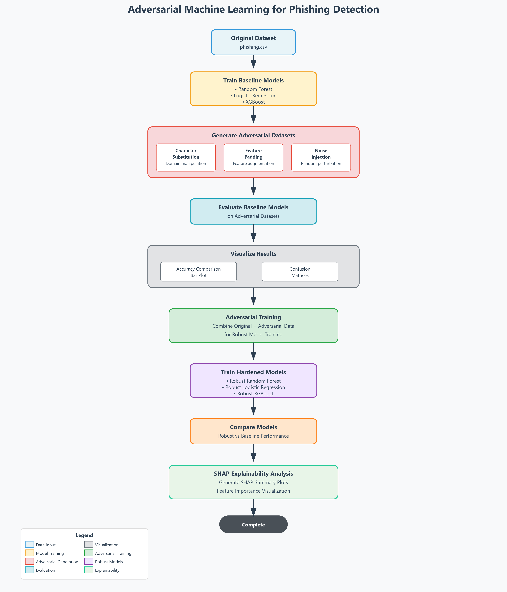

# Adversarial Machine Learning for Phishing Detection

This project demonstrates how adversarial attacks can degrade the performance of phishing detection models—and how adversarial training and explainable AI (SHAP) can be used to make models more robust and interpretable.

---

## Key Features

- Simulated adversarial attacks: character substitution, feature padding, and noise injection.
- Evaluation of baseline models (Random Forest, Logistic Regression, XGBoost) against adversarial samples.
- Adversarial training: Retraining models on original + adversarial data to improve robustness.
- SHAP Explainability: Visual analysis of feature importance under attacks.

---

## Project Structure

```
adversarial-ml-cybersecurity/
│
├── data/                   # Original + adversarial datasets
├── models/                 # Trained baseline models
├── models_robust/          # Hardened models after adversarial training
├── report/                 # Accuracy plots, LaTeX tables, SHAP summaries
├── scripts/                # All Python scripts (training, attack, SHAP, evaluation)
├── venv/                   # Virtual environment (excluded in Git)
├── .gitignore              # Files/folders to ignore in GitHub
└── README.md               # Project documentation
```

---

##  Setup Instructions

### 1. Create a virtual environment

```bash
python -m venv venv
venv\Scripts\activate    # On Windows
```

### 2. Install dependencies

```bash
pip install -r requirements.txt
```


---

## How to Run the Project

### 1. Train Baseline Models
```bash
python scripts/train_models.py
```

### 2. Simulate Attacks
```bash
python scripts/attack_simulation.py
```

### 3. Evaluate Models on Adversarial Data
```bash
python scripts/evaluate_adversial.py
```

### 4. Plot Accuracy and Confusion Matrix
```bash
python scripts/plot_advarsial_results.py
python scripts/confusion_matrix.py
```

### 5. Train Robust (Hardened) Models
```bash
python scripts/adversarial_training.py
```

### 6. Evaluate Robustness of Hardened Models
```bash
python scripts/evaluate_robustness.py
```

### 7. Run Explainability (SHAP)
```bash
python scripts/shap_all.py
```

---

##  Workflow Diagram 



---

## Example Outputs

- `report/adversarial_accuracy_plot.png` — Bar chart comparing baseline and robust model accuracy.
- `report/adversarial_results.tex` — LaTeX table ready for academic reports.
- `report/shap_summary_random_forest.png` — Feature importance under attack (Random Forest).

---

## Technologies Used

- Python, pandas, scikit-learn, XGBoost
- SHAP for model explainability
- Matplotlib & seaborn for plotting

---

##  Author

**Aditya S** — [GitHub Profile](https://github.com/adiibytes)

